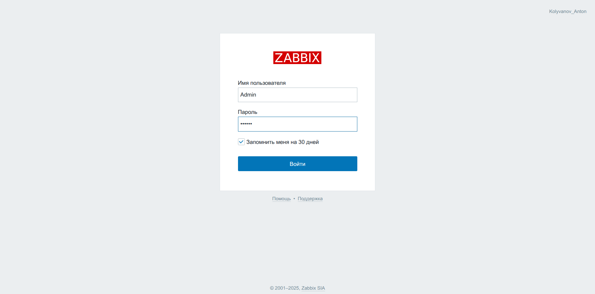
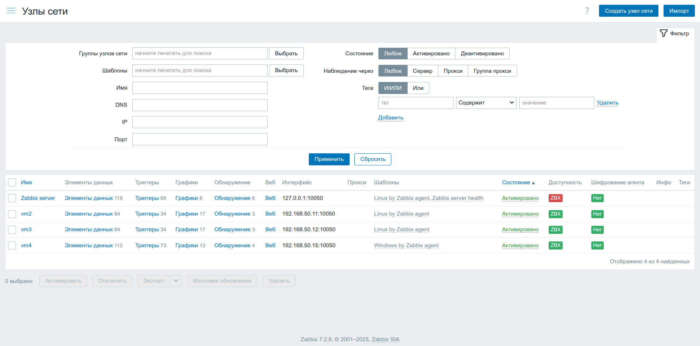
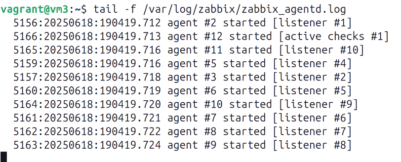
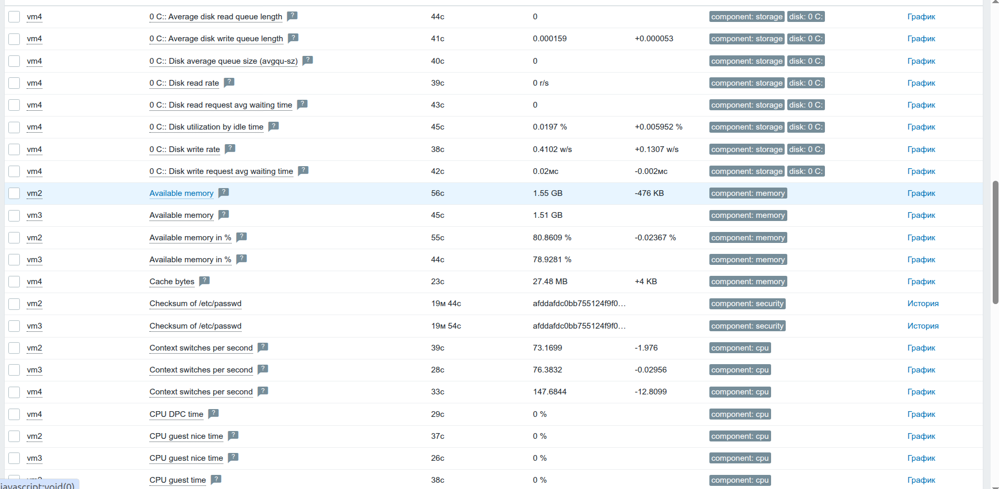
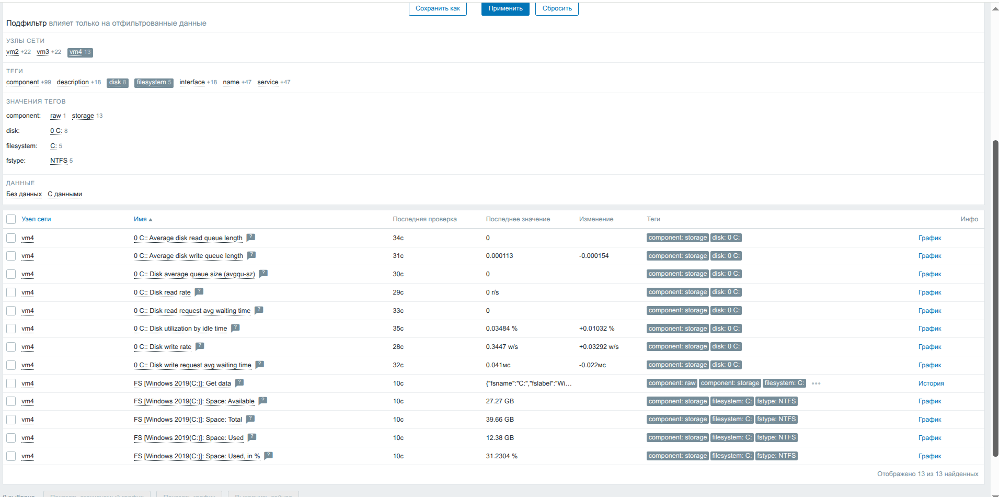

###  *Домашнее задание к занятию "* `Система мониторинга Zabbix`" - `Колыванов Антон`


---

### Задание 1

*Список команд для установки Zabbix server*  

```
sudo -s
wget https://repo.zabbix.com/zabbix/7.2/release/ubuntu/pool/main/z/zabbix-release/zabbix-release_latest_7.2+ubuntu22.04_all.deb
dpkg -i zabbix-release_latest_7.2+ubuntu22.04_all.deb
apt update
sudo apt install postgresql
apt install zabbix-server-pgsql zabbix-frontend-php php8.1-pgsql zabbix-apache-conf zabbix-sql-scripts zabbix-agent
#sudo -u postgres createuser --pwprompt zabbix
su - postgres -c 'psql --command "CREATE USER zabbix WITH PASSWORD
'\'123456789\'';"'
#sudo -u postgres createdb -O zabbix zabbix
su - postgres -c 'psql --command "CREATE DATABASE zabbix OWNER zabbix;"'
zcat /usr/share/zabbix/sql-scripts/postgresql/server.sql.gz | sudo -u zabbix psql zabbix
sed -i 's/# DBPassword=/DBPassword=123456789/g' /etc/zabbix/zabbix_server.conf
systemctl restart zabbix-server apache2
systemctl enable zabbix-server apache2

```




---

### Задание 2

*Список команд для установки Zabbix agent*  

```
cat sripts_zabbix_agent 
sudo -s
wget https://repo.zabbix.com/zabbix/7.2/release/ubuntu/pool/main/z/zabbix-release/zabbix-release_latest_7.2+ubuntu22.04_all.deb
dpkg -i zabbix-release_latest_7.2+ubuntu22.04_all.deb
apt update
apt install zabbix-agent
systemctl restart zabbix-agent
systemctl enable zabbix-agent
systemctl status zabbix-agent.service

```

*скриншот раздела Configuration > Hosts, где видно, что агенты подключены к серверу*
`  
*скриншот лога zabbix agent, где видно, что он работает с сервером*  

  
*скриншот раздела Monitoring > Latest data для обоих хостов, где видны поступающие от агентов данные*  

  
---

### Задание 3

*скриншот раздела Latest Data, где видно свободное место на диске C*  



